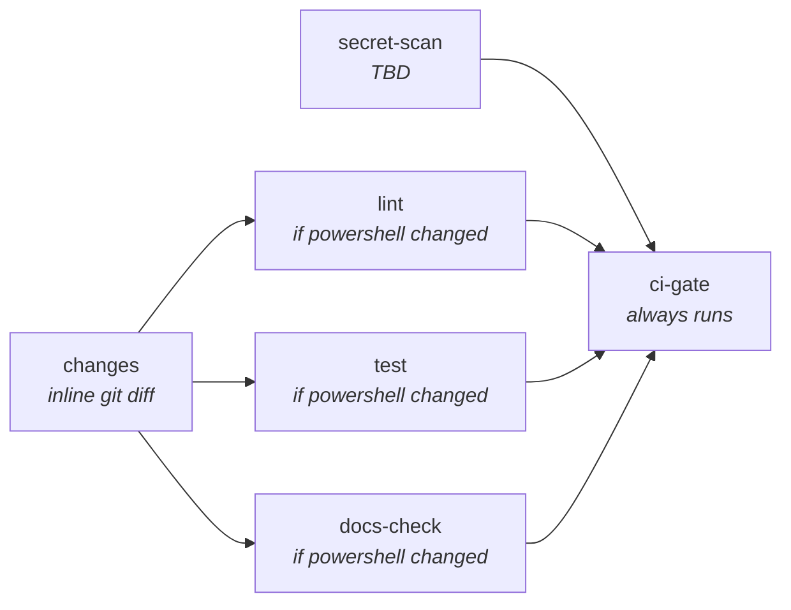
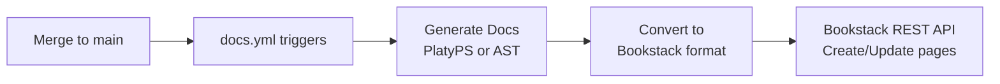
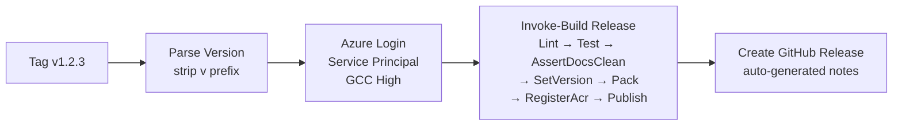

# CI/CD Standards Guide — Work Environment

This guide documents the CI/CD pipeline architecture for PowerShell projects on the organization's self-hosted GitHub Enterprise instance. It covers the branching model, build system, GitHub Actions workflows, secret scanning, documentation generation, release publishing, and local development hooks — all adapted for an air-gapped network and GCC High Azure environment.

## Open Decisions

The following items require resolution before full production adoption. Each is marked with a **Decision needed** callout in the relevant section.

| # | Decision | Section |
|---|----------|---------|
| 1 | Secret scanning tool selection | [Secret Scanning](#secret-scanning) |
| 2 | Third-party action mirroring strategy vs inline replacement | [Action Availability Matrix](#action-availability-matrix) |
| 3 | Bookstack deployment timeline and API configuration | [Documentation Workflow](#documentation-workflow-bookstack) |
| 4 | Bookstack page hierarchy mapping (shelf/book/chapter/page) | [Documentation Workflow](#documentation-workflow-bookstack) |
| 5 | Pre-commit hook installation method in air-gapped environment | [Local Development Setup](#local-development-setup) |
| 6 | Service principal secret rotation cadence | [GCC High Specifics](#gcc-high-specifics) |
| 7 | `Install-Module` vs `Install-PSResource` based on runner pwsh version | [CI Workflow](#module-installation-from-internal-psrepository) |
| 8 | `dorny/test-reporter` — mirror or drop in favor of artifact-only | [CI Workflow](#test-reporting) |

## Architecture Overview

Every code project follows a layered defense model where local hooks provide fast feedback and CI workflows enforce authoritative gates.

```mermaid
flowchart TB
    subgraph Local["Local Development"]
        Edit["Edit Code"] --> PreCommit["Pre-Commit<br/>Secret Scan (TBD)"]
        PreCommit --> PrePush["Pre-Push<br/>Invoke-Build Build"]
        PrePush --> Push["Push to dev"]
    end

    subgraph CI["GitHub Actions CI (Self-Hosted GHE)"]
        PR["PR: dev → main"] --> Changes["Changes Detection<br/>Inline git diff"]
        Changes --> Lint["Lint<br/>PSScriptAnalyzer"]
        Changes --> Test["Test<br/>Pester 5.x"]
        Changes --> DocsCheck["Docs Check<br/>AssertDocsClean"]
        Lint --> Gate["CI Gate"]
        Test --> Gate
        DocsCheck --> Gate
        SecretScan["Secret Scan<br/>(TBD)"] --> Gate
    end

    subgraph PostMerge["Post-Merge"]
        Merge["Merge to main"] --> Docs["Docs Workflow<br/>Generate → Bookstack API"]
        Merge --> SyncDev["Sync Dev<br/>main → dev"]
    end

    subgraph Release["Release"]
        Tag["Git Tag v*"] --> RelWf["Release Workflow<br/>Build → Publish to ACR (GCC High)"]
        RelWf --> GHRelease["GitHub Release"]
    end

    Push --> PR
    Gate -->|Pass| Merge
    Merge -.->|"Tag for release"| Tag

    style Local fill:#1a1a2e,stroke:#16213e
    style CI fill:#0f3460,stroke:#16213e
    style PostMerge fill:#533483,stroke:#16213e
    style Release fill:#e94560,stroke:#16213e
```



### Environment Comparison

| Aspect | Personal Environment | Work Environment |
|--------|---------------------|------------------|
| GitHub platform | github.com | Self-hosted GitHub Enterprise |
| Runners | `ubuntu-latest` (GitHub-hosted) | `[self-hosted, linux]` |
| Network access | Full internet | Air-gapped |
| Azure cloud | Commercial (`.azurecr.io`) | GCC High (`.azurecr.us`) |
| ACR SKU | Basic | Premium |
| CI authentication | OIDC federated credential | Service principal + secret |
| Documentation hosting | GitHub Pages + Zensical | Bookstack API (aspirational) |
| AI coding assistant | Claude Code (bot commits) | GitHub Copilot (VS Code chat — no bot commits) |
| Secret scanning | TruffleHog container | TBD |
| Dependency automation | Dependabot (weekly) | Manual / internal feeds |
| Third-party actions | GitHub Marketplace | Bundled core only; others need mirroring or replacement |
| PS module source | PSGallery | Internal PSRepository |

## Branching Model

All projects use a **dev-to-main PR workflow**. Direct commits to `main` are never allowed.

| Rule | Detail |
|------|--------|
| Development branch | `dev` |
| Production branch | `main` |
| CI triggers | `pull_request` to `main` only |
| Merge direction | `dev` → `main` via PR |
| Sync back | `sync-dev.yml` auto-merges `main` → `dev` after every merge |
| Branch protection | `enforce_admins` enabled; CI gate required |

### Workflow

1. Develop on `dev` — all commits land here
2. Push to `dev` — local pre-push hook runs `Invoke-Build Build` before allowing the push
3. Open a PR from `dev` to `main` — CI triggers automatically
4. CI validates — lint, test, docs check, secret scan must all pass
5. Review and merge — squash or merge commit into `main`
6. Auto-sync — `sync-dev.yml` merges `main` back into `dev` to prevent divergence

> **Warning:** Without `sync-dev.yml`, `dev` will diverge from `main`. Every project must have `sync-dev.yml` and `enforce_admins` enabled together.

## Build System: Invoke-Build

All projects use [Invoke-Build](https://github.com/nightroman/Invoke-Build) as their build system. CI workflows are thin YAML wrappers that call Invoke-Build tasks — build logic never lives in YAML.

### Build Files

| File | Purpose |
|------|---------|
| `<ProjectName>.build.ps1` | Build script with all task definitions |
| `build.config.psd1` | Project-specific configuration (module name, paths, thresholds) |

The build script is always named `<ProjectName>.build.ps1`, not `.build.ps1`. Invoke-Build auto-discovers `*.build.ps1` files. If multiple exist, alphabetically first wins.

### Standard Tasks

| Task | Dependencies | Purpose |
|------|-------------|---------|
| `Clean` | — | Remove and recreate `output/` directory |
| `Lint` | — | Run PSScriptAnalyzer against all source files |
| `Test` | — | Run Pester tests; enforce coverage threshold in Release mode |
| `Docs` | — | Generate PlatyPS command markdown with post-processing |
| `AssertDocsClean` | — | Verify committed docs match fresh generation |
| `BumpVersion` | — | Increment patch version in module manifest |
| `SetVersion` | — | Set explicit version from release tag |
| `Pack` | `Clean` | Copy module files to `output/<ModuleName>/` |
| `RegisterAcr` | — | Register ACR as PSResourceRepository (uses `*.azurecr.us` in GCC High) |
| `Publish` | — | Publish module to ACR |

### Composite Tasks

```powershell
# Local development — runs everything
task Build Clean, Lint, Test, Docs

# CI release pipeline — full validation + package + publish
task Release Lint, Test, AssertDocsClean, SetVersion, Pack, RegisterAcr, Publish
```

### Configuration File

`build.config.psd1` provides project-specific values so the build script stays generic:

```powershell
# Build configuration for <ModuleName>
@{
    ModuleName        = '<ModuleName>'
    ManifestPath      = '<ModuleName>.psd1'
    PublicDir         = 'Public'
    PrivateDir        = 'Private'
    TestsDir          = 'Tests'
    DocsDir           = 'docs/commands'
    OutputDir         = 'output'
    PSSASettingsPath  = 'PSScriptAnalyzerSettings.psd1'
    CoveragePaths     = @('Public', 'Private')
    CoverageThreshold = 50
    CoverageFormat    = 'JaCoCo'
    AcrRepoName       = '<ACR_REPO_NAME>'
}
```

For standalone script projects, replace `PublicDir`/`PrivateDir` with a `ScanPaths` array listing individual script files, and omit `Docs`/`AssertDocsClean` tasks from the `Build` composite.

### Key Build Script Patterns

**Line-ending normalization** — PlatyPS generates CRLF on Windows, but CI checks out with LF. The `Docs` and `AssertDocsClean` tasks normalize line endings using `[System.IO.File]::WriteAllText()` after a `-replace '\r\n', "\n"` pass. Never use `Set-Content` for doc files (it appends a trailing newline that breaks hash comparison).

**PSSA exclusion** — The build script itself (`.build.ps1`) is excluded from PSScriptAnalyzer scanning because Invoke-Build DSL aliases trigger false positives.

**Path-gated scanning** — The `Lint` task checks `Test-Path` before adding directories to the scan list, so it works for both module projects (with `Public/` and `Private/`) and script projects (with only `scripts/`).

## CI Workflow (`ci.yml`)

The CI workflow triggers on **pull requests to `main` only** — never on push. Every job has a 15-minute timeout and runs on self-hosted runners.

### Job Architecture



| Job | Runs When | Runner | What It Does |
|-----|-----------|--------|--------------|
| `changes` | Always | `[self-hosted, linux]` | Detects which file types changed using inline `git diff` |
| `lint` | PowerShell files changed | `[self-hosted, linux]` | `Invoke-Build Lint` |
| `test` | PowerShell files changed | `[self-hosted, linux]` | `Invoke-Build Test -Configuration Release` |
| `docs-check` | PowerShell files changed | `[self-hosted, linux]` | `Invoke-Build AssertDocsClean` |
| `secret-scan` | Always | `[self-hosted, linux]` | TBD — see [Secret Scanning](#secret-scanning) |
| `ci-gate` | Always | `[self-hosted, linux]` | Checks all job results; fails if any upstream job failed |

Module projects run the full 6-job pipeline. Standalone script projects drop `docs-check` and use a monolithic `build` job (`Clean, Lint, Test` + secret-scan + ci-gate).

### Path Detection (Inline git diff)

The personal environment uses `dorny/paths-filter@v4` (a third-party marketplace action) for path detection. In the work environment, this is replaced with an inline `git diff` approach that requires no external dependencies.

> **Note:** This approach requires `fetch-depth: 0` because `git diff` needs the full commit history to compare against the base branch. The personal environment used `fetch-depth: 1` because `dorny/paths-filter` uses the GitHub API instead of git.

```yaml
changes:
  name: Detect Changes
  runs-on: [self-hosted, linux]
  timeout-minutes: 15
  permissions:
    contents: read
    pull-requests: read
  outputs:
    powershell: ${{ steps.filter.outputs.powershell }}
  steps:
    - uses: actions/checkout@v6
      with:
        fetch-depth: 0

    - name: Detect PowerShell changes
      id: filter
      run: |
        CHANGED=$(git diff --name-only origin/${{ github.base_ref }}...HEAD)
        if echo "$CHANGED" | grep -qE '\.(ps1|psm1|psd1)$|\.build\.ps1|build\.config\.psd1|\.github/workflows/ci\.yml'; then
          echo "powershell=true" >> $GITHUB_OUTPUT
        else
          echo "powershell=false" >> $GITHUB_OUTPUT
        fi
```

### Module Installation from Internal PSRepository

All `Install-Module` calls target the internal PSRepository instead of PSGallery. The repository must be registered on each runner or registered inline in the workflow.

> **Decision needed:** Determine whether the internal PSRepository supports `Install-PSResource` (PowerShellGet v3 / PSResourceGet) or requires `Install-Module` (PowerShellGet v2). This depends on the pwsh version installed on self-hosted runners. The examples below use `Install-PSResource` for forward compatibility. If runners use PowerShell 7.2 or earlier, replace with `Install-Module` and `Register-PSRepository`.

```yaml
- name: Register internal PSRepository
  shell: pwsh
  run: |
    $repoParams = @{
        Name     = '<INTERNAL_REPO_NAME>'
        Uri      = '<INTERNAL_REPO_URI>'
        Trusted  = $true
    }
    if (-not (Get-PSResourceRepository -Name $repoParams.Name -ErrorAction SilentlyContinue)) {
        Register-PSResourceRepository @repoParams
    }

- name: Install build dependencies
  shell: pwsh
  run: |
    $modules = @(
        @{ Name = 'InvokeBuild' }
        @{ Name = 'PSScriptAnalyzer' }
        @{ Name = 'Pester'; Version = '5.0.0' }
    )
    foreach ($mod in $modules) {
        if (-not (Get-Module -ListAvailable -Name $mod.Name)) {
            $installParams = @{
                Name       = $mod.Name
                Repository = '<INTERNAL_REPO_NAME>'
                Scope      = 'CurrentUser'
            }
            if ($mod.Version) { $installParams.Version = $mod.Version }
            Install-PSResource @installParams
        }
    }
```

For the `docs-check` job, also install `Microsoft.PowerShell.PlatyPS`:

```yaml
- name: Install PlatyPS
  shell: pwsh
  run: |
    if (-not (Get-Module -ListAvailable -Name Microsoft.PowerShell.PlatyPS)) {
        $installParams = @{
            Name       = 'Microsoft.PowerShell.PlatyPS'
            Repository = '<INTERNAL_REPO_NAME>'
            Scope      = 'CurrentUser'
        }
        Install-PSResource @installParams
    }
```

### Module Caching

All jobs that install PowerShell modules share a cache strategy using the bundled `actions/cache@v5`:

```yaml
- name: Get cache week
  id: week
  run: echo "week=$(date +%Y-W%V)" >> $GITHUB_OUTPUT

- name: Cache PowerShell modules
  uses: actions/cache@v5
  with:
    path: ~/.local/share/powershell/Modules
    key: ps-modules-${{ steps.week.outputs.week }}-${{ hashFiles('.github/workflows/ci.yml') }}
    restore-keys: |
      ps-modules-
```

Module installation steps use a `Get-Module -ListAvailable` check to skip re-downloading on cache hits.

> **Note:** On self-hosted runners, `actions/cache` stores data on the runner's local filesystem. Cache persistence depends on the runner lifecycle. If runners are ephemeral (rebuilt regularly), the cache may not survive between runs. For persistent runners, the cache accumulates across workflow runs. Consider a dedicated cache directory or pre-installed modules if cache misses are frequent.

### Test Reporting

The personal environment uses `dorny/test-reporter@v3` to annotate PRs with rich test results. In the work environment, test results are uploaded as artifacts only.

> **Decision needed:** If `dorny/test-reporter` can be mirrored into an internal GHE organization, it provides significantly better PR-level test visibility. Evaluate mirroring feasibility before committing to artifact-only.

```yaml
- name: Run tests
  shell: pwsh
  run: Invoke-Build Test -Configuration Release

- name: Upload test results
  if: always()
  uses: actions/upload-artifact@v7
  with:
    name: test-results
    path: TestResults.xml

- name: Upload coverage results
  if: always()
  uses: actions/upload-artifact@v7
  with:
    name: coverage-results
    path: CoverageResults.xml
```

Both JUnit XML (test results) and JaCoCo XML (coverage) files are uploaded as separate artifacts for independent retention and download.

### Secret Scan (Placeholder)

> **Decision needed:** Select a secret scanning tool for the CI layer. Candidates:
>
> - **Gitleaks** — Go binary, no container needed. Can be pre-installed on runners. Actively maintained, widely adopted.
> - **Pre-installed TruffleHog** — Binary (not container) baked into the runner image. Same tool as the personal environment.
> - **GHE built-in secret scanning** — GitHub Enterprise has native secret scanning if Advanced Security is licensed. Operates outside the CI workflow.
> - **Local hooks only** — Rely solely on pre-commit hooks with no CI-layer backstop. Not recommended.

Placeholder job until a tool is selected:

```yaml
secret-scan:
  name: Secret Scan
  runs-on: [self-hosted, linux]
  timeout-minutes: 15
  steps:
    - uses: actions/checkout@v6
      with:
        fetch-depth: 0

    # TODO: Replace with selected secret scanning tool
    - name: Placeholder
      run: echo "::warning::Secret scanning tool not yet configured — see CI standards doc"
```

### CI Gate

The `ci-gate` job runs with `if: always()` and checks all upstream job results:

```yaml
ci-gate:
  name: CI Gate
  if: always()
  needs: [lint, test, docs-check, secret-scan]
  runs-on: [self-hosted, linux]
  timeout-minutes: 15
  steps:
    - name: Check job results
      run: |
        if [[ "${{ needs.lint.result }}" == "failure" || \
              "${{ needs.test.result }}" == "failure" || \
              "${{ needs.docs-check.result }}" == "failure" || \
              "${{ needs.secret-scan.result }}" == "failure" ]]; then
          echo "One or more CI jobs failed"
          exit 1
        fi
        echo "All CI jobs passed or were skipped"
```

Configure `CI / CI Gate` as the **single required status check** in branch protection settings. This covers all jobs through one check, avoiding race conditions with skipped jobs.

For standalone script projects, remove `docs-check` from the `needs` array and the failure check.

### Complete CI Workflow (`ci.yml`)

Copy-paste-ready workflow with all adaptations applied. Replace all `<PLACEHOLDER>` values with environment-specific configuration.

```yaml
# CI workflow for PowerShell projects — Work Environment (GHE / Air-Gapped)
# Triggers on pull_request to main only — no push triggers.
#
# CUSTOMIZATION: For standalone script projects without PlatyPS,
# remove the docs-check job and remove it from ci-gate needs array.

name: CI

on:
  pull_request:
    branches: [main]

jobs:
  changes:
    name: Detect Changes
    runs-on: [self-hosted, linux]
    timeout-minutes: 15
    permissions:
      contents: read
      pull-requests: read
    outputs:
      powershell: ${{ steps.filter.outputs.powershell }}
    steps:
      - uses: actions/checkout@v6
        with:
          fetch-depth: 0

      - name: Detect PowerShell changes
        id: filter
        run: |
          CHANGED=$(git diff --name-only origin/${{ github.base_ref }}...HEAD)
          if echo "$CHANGED" | grep -qE '\.(ps1|psm1|psd1)$|\.build\.ps1|build\.config\.psd1|\.github/workflows/ci\.yml'; then
            echo "powershell=true" >> $GITHUB_OUTPUT
          else
            echo "powershell=false" >> $GITHUB_OUTPUT
          fi

  lint:
    name: PSScriptAnalyzer
    needs: changes
    if: needs.changes.outputs.powershell == 'true'
    runs-on: [self-hosted, linux]
    timeout-minutes: 15
    permissions:
      contents: read
    steps:
      - uses: actions/checkout@v6

      - name: Get cache week
        id: week
        run: echo "week=$(date +%Y-W%V)" >> $GITHUB_OUTPUT

      - name: Cache PowerShell modules
        uses: actions/cache@v5
        with:
          path: ~/.local/share/powershell/Modules
          key: ps-lint-${{ steps.week.outputs.week }}-${{ hashFiles('.github/workflows/ci.yml') }}
          restore-keys: |
            ps-lint-

      - name: Register internal PSRepository
        shell: pwsh
        run: |
          $repoParams = @{
              Name    = '<INTERNAL_REPO_NAME>'
              Uri     = '<INTERNAL_REPO_URI>'
              Trusted = $true
          }
          if (-not (Get-PSResourceRepository -Name $repoParams.Name -ErrorAction SilentlyContinue)) {
              Register-PSResourceRepository @repoParams
          }

      - name: Install build dependencies
        shell: pwsh
        run: |
          foreach ($mod in @('InvokeBuild', 'PSScriptAnalyzer')) {
              if (-not (Get-Module -ListAvailable -Name $mod)) {
                  $installParams = @{
                      Name       = $mod
                      Repository = '<INTERNAL_REPO_NAME>'
                      Scope      = 'CurrentUser'
                  }
                  Install-PSResource @installParams
              }
          }

      - name: Run lint
        shell: pwsh
        run: Invoke-Build Lint

  test:
    name: Pester Tests
    needs: changes
    if: needs.changes.outputs.powershell == 'true'
    runs-on: [self-hosted, linux]
    timeout-minutes: 15
    permissions:
      contents: read
    steps:
      - uses: actions/checkout@v6

      - name: Get cache week
        id: week
        run: echo "week=$(date +%Y-W%V)" >> $GITHUB_OUTPUT

      - name: Cache PowerShell modules
        uses: actions/cache@v5
        with:
          path: ~/.local/share/powershell/Modules
          key: ps-test-${{ steps.week.outputs.week }}-${{ hashFiles('.github/workflows/ci.yml') }}
          restore-keys: |
            ps-test-

      - name: Register internal PSRepository
        shell: pwsh
        run: |
          $repoParams = @{
              Name    = '<INTERNAL_REPO_NAME>'
              Uri     = '<INTERNAL_REPO_URI>'
              Trusted = $true
          }
          if (-not (Get-PSResourceRepository -Name $repoParams.Name -ErrorAction SilentlyContinue)) {
              Register-PSResourceRepository @repoParams
          }

      - name: Install build dependencies
        shell: pwsh
        run: |
          foreach ($mod in @(
              @{ Name = 'InvokeBuild' },
              @{ Name = 'Pester'; Version = '5.0.0' }
          )) {
              if (-not (Get-Module -ListAvailable -Name $mod.Name)) {
                  $installParams = @{
                      Name       = $mod.Name
                      Repository = '<INTERNAL_REPO_NAME>'
                      Scope      = 'CurrentUser'
                  }
                  if ($mod.Version) { $installParams.Version = $mod.Version }
                  Install-PSResource @installParams
              }
          }

      - name: Run tests
        shell: pwsh
        run: Invoke-Build Test -Configuration Release

      - name: Upload test results
        if: always()
        uses: actions/upload-artifact@v7
        with:
          name: test-results
          path: TestResults.xml

      - name: Upload coverage results
        if: always()
        uses: actions/upload-artifact@v7
        with:
          name: coverage-results
          path: CoverageResults.xml

  docs-check:
    name: Docs Verification
    needs: changes
    if: needs.changes.outputs.powershell == 'true'
    runs-on: [self-hosted, linux]
    timeout-minutes: 15
    permissions:
      contents: read
    steps:
      - uses: actions/checkout@v6

      - name: Get cache week
        id: week
        run: echo "week=$(date +%Y-W%V)" >> $GITHUB_OUTPUT

      - name: Cache PowerShell modules
        uses: actions/cache@v5
        with:
          path: ~/.local/share/powershell/Modules
          key: ps-docs-${{ steps.week.outputs.week }}-${{ hashFiles('.github/workflows/ci.yml') }}
          restore-keys: |
            ps-docs-

      - name: Register internal PSRepository
        shell: pwsh
        run: |
          $repoParams = @{
              Name    = '<INTERNAL_REPO_NAME>'
              Uri     = '<INTERNAL_REPO_URI>'
              Trusted = $true
          }
          if (-not (Get-PSResourceRepository -Name $repoParams.Name -ErrorAction SilentlyContinue)) {
              Register-PSResourceRepository @repoParams
          }

      - name: Install build dependencies
        shell: pwsh
        run: |
          foreach ($mod in @('InvokeBuild')) {
              if (-not (Get-Module -ListAvailable -Name $mod)) {
                  $installParams = @{
                      Name       = $mod
                      Repository = '<INTERNAL_REPO_NAME>'
                      Scope      = 'CurrentUser'
                  }
                  Install-PSResource @installParams
              }
          }
          if (-not (Get-Module -ListAvailable -Name Microsoft.PowerShell.PlatyPS)) {
              $installParams = @{
                  Name       = 'Microsoft.PowerShell.PlatyPS'
                  Repository = '<INTERNAL_REPO_NAME>'
                  Scope      = 'CurrentUser'
              }
              Install-PSResource @installParams
          }

      - name: Assert docs are current
        shell: pwsh
        run: Invoke-Build AssertDocsClean

  secret-scan:
    name: Secret Scan
    runs-on: [self-hosted, linux]
    timeout-minutes: 15
    steps:
      - uses: actions/checkout@v6
        with:
          fetch-depth: 0

      # TODO: Replace with selected secret scanning tool
      # See "Secret Scanning" section for candidates
      - name: Placeholder
        run: echo "::warning::Secret scanning tool not yet configured"

  ci-gate:
    name: CI Gate
    if: always()
    needs: [lint, test, docs-check, secret-scan]
    # CUSTOMIZATION: Remove docs-check from needs for standalone script projects
    runs-on: [self-hosted, linux]
    timeout-minutes: 15
    steps:
      - name: Check job results
        run: |
          if [[ "${{ needs.lint.result }}" == "failure" || \
                "${{ needs.test.result }}" == "failure" || \
                "${{ needs.docs-check.result }}" == "failure" || \
                "${{ needs.secret-scan.result }}" == "failure" ]]; then
            echo "One or more CI jobs failed"
            exit 1
          fi
          echo "All CI jobs passed or were skipped"
```

## Documentation Workflow (Bookstack)

> **Note:** Bookstack is not yet deployed. This section documents the target architecture so that implementation can begin when the platform is available.

Documentation generation (PlatyPS for modules, AST-based extraction for standalone scripts) is unchanged from the personal environment. Only the deployment target changes — Bookstack API replaces GitHub Pages + Zensical.

### Target Architecture



### Module Projects (Commit-and-Verify)

The documentation pattern for module projects is unchanged:

1. Developer runs `Invoke-Build Docs` locally to regenerate `docs/commands/*.md` from PlatyPS
2. Developer commits the updated docs alongside source changes
3. CI runs `AssertDocsClean` to verify committed docs match a fresh generation
4. On merge, the docs workflow reads committed markdown and pushes to Bookstack

### Standalone Script Projects (CI-Generate)

Standalone script projects use `Export-ScriptDocumentation.ps1` (AST-based) that runs fresh in CI:

1. CI generates `docs/commands/*.md` from script AST
2. Docs workflow reads generated markdown and pushes to Bookstack

In this pattern, `docs/commands/` is **gitignored** — generated fresh every run, never committed.

### Bookstack API Integration

The Bookstack REST API supports creating, reading, updating, and deleting content at multiple hierarchy levels:

| Bookstack Concept | Maps To | API Endpoint |
|-------------------|---------|-------------|
| Shelf | Team or domain area | `GET/POST /api/shelves` |
| Book | Project | `GET/POST /api/books` |
| Chapter | Documentation section | `GET/POST /api/chapters` |
| Page | Individual command doc | `GET/POST/PUT /api/pages` |

Skeleton workflow step for pushing a page:

```yaml
- name: Push docs to Bookstack
  shell: pwsh
  env:
    BOOKSTACK_URL: ${{ secrets.BOOKSTACK_URL }}
    BOOKSTACK_TOKEN_ID: ${{ secrets.BOOKSTACK_TOKEN_ID }}
    BOOKSTACK_TOKEN_SECRET: ${{ secrets.BOOKSTACK_TOKEN_SECRET }}
  run: |
    $headers = @{
        Authorization = "Token $($env:BOOKSTACK_TOKEN_ID):$($env:BOOKSTACK_TOKEN_SECRET)"
    }
    # TODO: Implement page create/update logic
    # GET  <BOOKSTACK_URL>/api/pages?filter[book_id]=<id>
    # POST <BOOKSTACK_URL>/api/pages        (create)
    # PUT  <BOOKSTACK_URL>/api/pages/{id}   (update)
```

### Items Removed from Personal Environment

The following tools and configurations from the personal docs workflow are not used:

- `actions/setup-python` — no Python needed (Zensical removed)
- `requirements.txt` — no pip dependencies
- `mkdocs.yml` — no Zensical/MkDocs configuration
- `actions/configure-pages` — no GitHub Pages
- `actions/upload-pages-artifact` — no GitHub Pages
- `actions/deploy-pages` — no GitHub Pages

### Decision Register

> **Decision needed:** The following must be resolved before implementing the docs workflow:
>
> - **Bookstack deployment timeline** — When will the instance be available?
> - **Markdown vs HTML** — Bookstack accepts both. Markdown preserves source fidelity; HTML allows richer formatting.
> - **Page hierarchy** — How do projects, commands, and guides map to shelves/books/chapters/pages?
> - **Authentication** — API token per project (scoped) or shared service token?
> - **Interim strategy** — How is documentation shared before Bookstack is available? (Manual wiki edits, shared drive, etc.)

## Release Workflow (`release.yml`)

The release workflow triggers on **tag push matching `v*`**. It builds, validates, packages, and publishes the module to Azure Container Registry in GCC High.

### Prerequisites

| Requirement | Detail |
|-------------|--------|
| GitHub Environment | `deploy` with service principal secrets |
| Secrets | `AZURE_CLIENT_ID`, `AZURE_CLIENT_SECRET`, `AZURE_TENANT_ID`, `AZURE_SUBSCRIPTION_ID` |
| Variables | `ACR_LOGIN_SERVER` (must be `*.azurecr.us` for GCC High) |
| Azure role | `AcrPush` scoped to the ACR resource |
| Runner modules | `Az.Accounts` available (pre-installed or from internal PSRepository) |

> **Note:** The personal environment uses OIDC federated credentials (`id-token: write` permission + `azure/login` action). The work environment uses a service principal with client secret and inline `Connect-AzAccount`. No `id-token: write` permission is needed.

### Pipeline Steps



1. **Parse version** — Extracts `1.2.3` from tag `v1.2.3`, validates format `^\d+\.\d+\.\d+$`
2. **Install dependencies** — InvokeBuild, Pester, PSScriptAnalyzer, PlatyPS from internal PSRepository (cached)
3. **Azure login** — Inline `Connect-AzAccount` with service principal and `-Environment AzureUSGovernment`
4. **Run release pipeline** — `Invoke-Build -Task Release -Configuration Release -Version $version`
5. **Create GitHub Release** — Auto-generated release notes from merged PRs

### Creating a Release

```bash
git tag v1.2.3
git push origin v1.2.3
```

The release workflow handles everything from there.

### Complete Release Workflow (`release.yml`)

```yaml
# Tag-driven release workflow — Work Environment (GHE / GCC High)
# Triggers on v* tags. Authenticates to Azure via service principal,
# runs Invoke-Build Release pipeline, publishes to ACR (GCC High).
#
# Prerequisites:
#   - GitHub Environment named 'deploy' with service principal secrets
#   - Secrets: AZURE_CLIENT_ID, AZURE_CLIENT_SECRET, AZURE_TENANT_ID, AZURE_SUBSCRIPTION_ID
#   - Variable: ACR_LOGIN_SERVER (*.azurecr.us)
#   - AcrPush role on the ACR resource for the service principal

name: Release

on:
  push:
    tags:
      - 'v*'

permissions:
  contents: write    # Required to create GitHub Releases

jobs:
  release:
    name: Release to ACR
    runs-on: [self-hosted, linux]
    timeout-minutes: 15
    environment: deploy

    steps:
      - uses: actions/checkout@v6

      - name: Parse version from tag
        id: version
        shell: pwsh
        run: |
          $tag = $env:GITHUB_REF_NAME
          $version = $tag -replace '^v', ''
          if ($version -notmatch '^\d+\.\d+\.\d+$') {
              throw "Tag '$tag' does not produce a valid SemVer string. Expected format: v1.2.3"
          }
          "version=$version" | Out-File $env:GITHUB_OUTPUT -Append
          Write-Host "Releasing version: $version"

      - name: Get cache week
        id: week
        run: echo "week=$(date +%Y-W%V)" >> $GITHUB_OUTPUT

      - name: Cache PowerShell modules
        uses: actions/cache@v5
        with:
          path: ~/.local/share/powershell/Modules
          key: ps-release-${{ steps.week.outputs.week }}-${{ hashFiles('.github/workflows/release.yml') }}
          restore-keys: |
            ps-release-

      - name: Register internal PSRepository
        shell: pwsh
        run: |
          $repoParams = @{
              Name    = '<INTERNAL_REPO_NAME>'
              Uri     = '<INTERNAL_REPO_URI>'
              Trusted = $true
          }
          if (-not (Get-PSResourceRepository -Name $repoParams.Name -ErrorAction SilentlyContinue)) {
              Register-PSResourceRepository @repoParams
          }

      - name: Install build dependencies
        shell: pwsh
        run: |
          foreach ($mod in @(
              @{ Name = 'InvokeBuild' },
              @{ Name = 'Pester'; Version = '5.0.0' },
              @{ Name = 'PSScriptAnalyzer' }
          )) {
              if (-not (Get-Module -ListAvailable -Name $mod.Name)) {
                  $installParams = @{
                      Name       = $mod.Name
                      Repository = '<INTERNAL_REPO_NAME>'
                      Scope      = 'CurrentUser'
                  }
                  if ($mod.Version) { $installParams.Version = $mod.Version }
                  Install-PSResource @installParams
              }
          }
          if (-not (Get-Module -ListAvailable -Name Microsoft.PowerShell.PlatyPS)) {
              $installParams = @{
                  Name       = 'Microsoft.PowerShell.PlatyPS'
                  Repository = '<INTERNAL_REPO_NAME>'
                  Scope      = 'CurrentUser'
              }
              Install-PSResource @installParams
          }

      - name: Login to Azure (Service Principal — GCC High)
        shell: pwsh
        env:
          AZURE_CLIENT_ID: ${{ secrets.AZURE_CLIENT_ID }}
          AZURE_CLIENT_SECRET: ${{ secrets.AZURE_CLIENT_SECRET }}
          AZURE_TENANT_ID: ${{ secrets.AZURE_TENANT_ID }}
          AZURE_SUBSCRIPTION_ID: ${{ secrets.AZURE_SUBSCRIPTION_ID }}
        run: |
          $securePassword = ConvertTo-SecureString $env:AZURE_CLIENT_SECRET -AsPlainText -Force
          $credential = [PSCredential]::new($env:AZURE_CLIENT_ID, $securePassword)
          $connectParams = @{
              ServicePrincipal = $true
              Credential       = $credential
              Tenant           = $env:AZURE_TENANT_ID
              Subscription     = $env:AZURE_SUBSCRIPTION_ID
              Environment      = 'AzureUSGovernment'
          }
          Connect-AzAccount @connectParams

      - name: Run release pipeline
        shell: pwsh
        env:
          ACR_LOGIN_SERVER: ${{ vars.ACR_LOGIN_SERVER }}
        run: |
          $buildParams = @{
              Task          = 'Release'
              Configuration = 'Release'
              Version       = '${{ steps.version.outputs.version }}'
          }
          Invoke-Build @buildParams

      - name: Create GitHub Release
        uses: actions/github-script@v8
        with:
          script: |
            await github.rest.repos.createRelease({
              owner:                  context.repo.owner,
              repo:                   context.repo.repo,
              tag_name:               context.ref.replace('refs/tags/', ''),
              name:                   context.ref.replace('refs/tags/', ''),
              generate_release_notes: true,
              draft:                  false,
              prerelease:             false
            });
```

> **Note:** The `RegisterAcr` task in the build script reads `$env:ACR_LOGIN_SERVER` and constructs the repository URI automatically. No build script changes are needed for GCC High — the `.azurecr.us` domain flows through from the repository variable.

## Dev Sync Workflow (`sync-dev.yml`)

A lightweight workflow that keeps `dev` current after every merge to `main`:

```yaml
name: Sync dev with main

on:
  push:
    branches: [main]

jobs:
  sync:
    name: Merge main into dev
    runs-on: [self-hosted, linux]
    permissions:
      contents: write
    steps:
      - uses: actions/checkout@v6
        with:
          fetch-depth: 0

      - name: Merge main into dev
        run: |
          git config user.name "github-actions[bot]"
          git config user.email "github-actions[bot]@users.noreply.github.com"
          git checkout dev
          git merge origin/main --no-edit
          git push origin dev
```

If there are merge conflicts (from concurrent direct edits to `dev`), the workflow fails and requires manual resolution.

> **Warning:** The sync workflow needs `contents: write` permission. The `github-actions[bot]` identity is used for the merge commit. Verify this identity exists on your GHE instance.

## Secret Scanning

Secret scanning operates at three layers. The pre-push layer (Invoke-Build) works as-is. The pre-commit and CI layers require tool selection.

> **Decision needed:** Select tools for the pre-commit and CI layers before first production use. See candidate list below.

| Layer | Tool | When | Scope | Status |
|-------|------|------|-------|--------|
| Pre-commit hook | TBD | Every `git commit` | Staged changes only | Needs tool selection |
| CI job | TBD | Every PR | Full repo history | Needs tool selection |
| Pre-push hook | Invoke-Build | Every `git push` | Full build (lint/test) | Ready |

### Candidate Tools

**Gitleaks** (recommended for air-gapped environments):
- Single Go binary — no container runtime required
- Pre-install on runners and developer machines
- Supports custom rules via `.gitleaks.toml`
- Pre-commit hook: `gitleaks detect --staged`
- CI scan: `gitleaks detect --source . --log-opts="--all"`

**TruffleHog binary**:
- Available as a standalone binary (not just a container)
- Same tool as the personal environment for consistency
- Pre-commit hook: `trufflehog filesystem --staged`
- CI scan: `trufflehog git file://. --only-verified`

**GHE Advanced Security**:
- Native integration if licensed
- Operates outside CI workflow (no YAML configuration needed)
- Covers push protection and historical scanning
- Does not replace local pre-commit hooks

## Local Development Setup

### Build Commands

All build commands use Invoke-Build. Run these from the project root:

| Command | Purpose |
|---------|---------|
| `Invoke-Build` | Full build: Clean, Lint, Test, Docs |
| `Invoke-Build Lint` | PSScriptAnalyzer only |
| `Invoke-Build Test` | Pester tests only |
| `Invoke-Build Docs` | Regenerate PlatyPS command docs (commit the output) |
| `Invoke-Build AssertDocsClean` | Verify committed docs match fresh generation |
| `Invoke-Build Build -Configuration Release` | Full build with code coverage enforcement |
| `Invoke-Build BumpVersion` | Increment patch version in manifest |
| `Invoke-Build Pack` | Package module to `output/` |
| `Invoke-Build ?` | List all available tasks |

### One-Time Setup: Module Installation

In the air-gapped environment, all PowerShell modules come from the internal PSRepository. Run these commands once per developer machine:

```powershell
# Register the internal PSRepository (one-time)
$repoParams = @{
    Name    = '<INTERNAL_REPO_NAME>'
    Uri     = '<INTERNAL_REPO_URI>'
    Trusted = $true
}
Register-PSResourceRepository @repoParams

# Install build dependencies
$modules = @(
    'InvokeBuild'
    'PSScriptAnalyzer'
    'Pester'
    'Microsoft.PowerShell.PlatyPS'
)
foreach ($mod in $modules) {
    Install-PSResource -Name $mod -Repository '<INTERNAL_REPO_NAME>' -Scope CurrentUser
}
```

### Pre-Commit Hook Installation

> **Decision needed:** Select an installation method for pre-commit hooks in the air-gapped environment. Options:
>
> - **Internal PyPI mirror** — If an internal PyPI mirror exists, `pip install pre-commit` works as-is. Most flexible; supports the full `.pre-commit-config.yaml` ecosystem.
> - **Pre-built binary** — `pre-commit` distributes standalone binaries. Download once, distribute to developer machines.
> - **Direct git hook script** — Simplest fallback. Write the secret scanning command directly into `.git/hooks/pre-commit`. No `pre-commit` framework needed.

Direct git hook example (no `pre-commit` framework required):

```bash
#!/usr/bin/env bash
# .git/hooks/pre-commit — Secret scan on staged changes
# Requires: gitleaks or trufflehog binary on PATH

if command -v gitleaks &>/dev/null; then
    gitleaks detect --staged --verbose
    if [ $? -ne 0 ]; then
        echo "Secret detected in staged changes. Commit blocked."
        exit 1
    fi
else
    echo "WARNING: gitleaks not found on PATH. Skipping pre-commit secret scan."
fi
```

### Pre-Push Hook

The pre-push hook runs the full `Invoke-Build Build` pipeline before allowing a push. Install with the project's hook installer script:

```powershell
./scripts/Install-GitHooks.ps1
```

This script works as-is — no changes needed for the work environment.

## Dependency Management

The personal environment uses four automated mechanisms (Dependabot, pip Dependabot, cache rotation, pre-commit autoupdate). The air-gapped work environment replaces most of these with manual processes and internal feeds.

### Comparison

| Category | Personal Mechanism | Work Mechanism |
|----------|-------------------|----------------|
| GitHub Actions | Dependabot (weekly) | Updated with GHE upgrades; quarterly manual review |
| Python packages | Dependabot (weekly) | Not applicable (no Zensical/MkDocs) |
| PowerShell modules | Weekly cache key rotation + PSGallery | Weekly cache key rotation + internal PSRepository |
| Pre-commit hooks | `pre-commit-update.yml` (weekly) | Manual updates |

### PowerShell Module Updates

The weekly cache key rotation pattern from the personal environment still works. Each week, the cache key rolls over, forcing a fresh `Install-PSResource` from the internal PSRepository. This picks up any new module versions that have been published to the internal feed.

The internal PSRepository must be kept current by the team that manages it. If module updates are critical (e.g., security patches for PSScriptAnalyzer), coordinate with the feed maintainer.

### GitHub Actions Version Management

Bundled actions (`actions/checkout`, `actions/cache`, `actions/upload-artifact`, `actions/github-script`) are updated when the GHE instance is upgraded. Pin to major versions in workflows (e.g., `@v6`) and verify compatibility after each GHE upgrade.

Recommended: quarterly review of action versions against the GHE release notes.

### Pre-Commit Hook Updates

Without internet access, the `pre-commit-update.yml` scheduled workflow and `peter-evans/create-pull-request` action are both unavailable. Pre-commit hook tool versions (e.g., Gitleaks, TruffleHog) must be updated manually:

1. Download the updated binary on an internet-connected machine
2. Transfer to the air-gapped environment
3. Distribute to developer machines and runner images
4. Update version references in hook configurations

### Items Removed

- `dependabot.yml` — Dependabot cannot reach external registries
- `pre-commit-update.yml` — Requires internet access and `peter-evans/create-pull-request`
- pip ecosystem — No Python dependencies in the work environment

## PSScriptAnalyzer Configuration

All projects share a standard `PSScriptAnalyzerSettings.psd1`:

- **Severity:** `Warning` and `Error` (informational rules are excluded)
- **Included rules:** `PSAvoidUsingCmdletAliases`, `PSAvoidUsingWriteHost`, `PSUseDeclaredVarsMoreThanAssignments`, `PSAvoidUsingPositionalParameters`
- **Excluded paths:** `.build.ps1` files (Invoke-Build DSL aliases trigger false positives)

This configuration is environment-agnostic — no changes needed for the work environment.

## Branch Protection Checklist

When setting up a new repository on the GHE instance:

- [ ] Enable branch protection on `main`
- [ ] Require pull request reviews
- [ ] Add `CI / CI Gate` as a required status check
- [ ] Enable `enforce_admins` (prevents bypassing protection rules)
- [ ] Verify auto-merge is available on this GHE version and enable it
- [ ] Create `deploy` environment with service principal secrets:
  - `AZURE_CLIENT_ID`
  - `AZURE_CLIENT_SECRET`
  - `AZURE_TENANT_ID`
  - `AZURE_SUBSCRIPTION_ID`
- [ ] Set `ACR_LOGIN_SERVER` repository variable (must be `*.azurecr.us` for GCC High)
- [ ] Verify `github-actions[bot]` identity exists (required for `sync-dev.yml`)

> **Note:** The GHE admin interface may differ from github.com. Consult your GHE version's documentation for the exact UI paths to these settings.

## Action Availability Matrix

> **Decision needed:** Determine whether any third-party actions can be mirrored into an internal GHE organization. Mirroring provides richer functionality (e.g., `dorny/test-reporter` for PR annotations) but adds maintenance burden. Inline script replacements have zero external dependencies.

| Action | Personal Version | Work Status | Replacement Strategy |
|--------|-----------------|-------------|---------------------|
| `actions/checkout` | `@v6` | Bundled | Use as-is |
| `actions/cache` | `@v5` | Bundled | Use as-is |
| `actions/upload-artifact` | `@v7` | Bundled | Use as-is |
| `actions/github-script` | `@v8` | Bundled | Use as-is |
| `dorny/paths-filter` | `@v4` | Unavailable | Inline `git diff` ([CI Workflow](#path-detection-inline-git-diff)) |
| `dorny/test-reporter` | `@v3` | Unavailable | Artifact-only ([CI Workflow](#test-reporting)) |
| `azure/login` | `@v3` | Unavailable | Inline `Connect-AzAccount` ([Release Workflow](#complete-release-workflow-releaseyml)) |
| `trufflesecurity/trufflehog` | `@main` | Unavailable | TBD ([Secret Scanning](#secret-scanning)) |
| `peter-evans/create-pull-request` | `@v8` | Unavailable | `gh pr create` CLI (if GHE CLI is available) |
| `actions/setup-python` | `@v6` | Not needed | Removed (no Zensical/MkDocs) |
| `actions/configure-pages` | `@v5` | Not needed | Removed (no GitHub Pages) |
| `actions/upload-pages-artifact` | `@v4` | Not needed | Removed (no GitHub Pages) |
| `actions/deploy-pages` | `@v5` | Not needed | Removed (no GitHub Pages) |

Bundled action versions are tied to the GHE instance version. After each GHE upgrade, verify that the pinned major versions in workflows are still valid.

## Air-Gapped Considerations

This section collects cross-cutting concerns that affect multiple parts of the CI/CD pipeline in an air-gapped environment.

### Dependency Strategy

All dependencies must come from internal sources. No workflow step may assume internet access.

| Dependency Type | Source | Notes |
|----------------|--------|-------|
| PowerShell modules | Internal PSRepository | InvokeBuild, Pester, PSScriptAnalyzer, PlatyPS |
| GitHub Actions | Bundled with GHE | `actions/checkout`, `actions/cache`, `actions/upload-artifact`, `actions/github-script` |
| Secret scanning binary | Pre-installed on runners | Gitleaks or TruffleHog binary |
| Az PowerShell modules | Pre-installed or internal PSRepository | `Az.Accounts` (required for release workflow) |
| Git | Pre-installed on runners | Required for all workflows |

### Runner Prerequisites

Self-hosted runners must have the following pre-installed:

| Component | Minimum Version | Purpose |
|-----------|----------------|---------|
| PowerShell (pwsh) | 7.4+ | Build system, all PowerShell steps |
| Git | 2.x | Checkout, diff, merge operations |
| Az.Accounts module | Latest | Azure authentication in release workflow |
| Bash | 4.x+ | Shell steps in workflows |

Optional (depending on decisions):
- Gitleaks or TruffleHog binary for secret scanning
- `gh` CLI for GitHub API operations

### Action Mirroring (If Needed)

If a third-party action is essential and cannot be replaced with an inline script:

1. Clone the action repository on an internet-connected machine
2. Strip unnecessary history: `git clone --depth=1 --branch=<tag>`
3. Transfer the repository to the GHE instance (create under an internal org, e.g., `internal-actions/`)
4. Reference in workflows as `internal-actions/<action-name>@<tag>`
5. Establish a review cadence for upstream updates

> **Recommendation:** Prefer inline script replacements over mirroring to minimize maintenance burden. Only mirror actions that provide significant value over a script-based approach (e.g., `dorny/test-reporter` for PR annotations).

### Cache Behavior on Self-Hosted Runners

`actions/cache` on self-hosted runners stores cache entries on the runner's local filesystem (not in cloud storage). Key implications:

- **Persistent runners**: Cache accumulates across workflow runs. The weekly key rotation pattern works as intended.
- **Ephemeral runners**: Cache is lost when the runner is rebuilt. Consider pre-installing modules in the runner image instead of relying on caching.
- **Shared runners**: Multiple repositories may share the same runner. Cache keys include the workflow file hash to prevent cross-project collisions.

If caching is unreliable, pre-install all PowerShell modules in the runner image and remove the `actions/cache` steps entirely. Module installation steps will no-op due to the `Get-Module -ListAvailable` guard.

### Code and Template Transfer

CI workflow templates, build scripts, and other shared files must be transferred from the development environment to the air-gapped GHE instance. Establish a transfer process:

1. Maintain a "golden" repository on the development side with all templates
2. Package as a versioned archive (e.g., `ci-templates-v1.0.0.tar.gz`)
3. Transfer via approved media to the air-gapped environment
4. Unpack into a shared GHE repository that projects reference

## GCC High Specifics

### Endpoint Comparison

| Service | Commercial | GCC High |
|---------|-----------|----------|
| Azure Resource Manager | `management.azure.com` | `management.usgovcloudapi.net` |
| Azure Container Registry | `*.azurecr.io` | `*.azurecr.us` |
| Entra ID (login) | `login.microsoftonline.com` | `login.microsoftonline.us` |
| Microsoft Graph | `graph.microsoft.com` | `graph.microsoft.us` |
| Key Vault | `*.vault.azure.net` | `*.vault.usgovcloudapi.net` |
| Azure Storage | `*.blob.core.windows.net` | `*.blob.core.usgovcloudapi.net` |

### Connect-AzAccount Configuration

Always specify `-Environment AzureUSGovernment` when authenticating. Omitting this parameter silently targets the commercial cloud, which will either fail or — worse — succeed against the wrong tenant.

```powershell
$securePassword = ConvertTo-SecureString $env:AZURE_CLIENT_SECRET -AsPlainText -Force
$credential = [PSCredential]::new($env:AZURE_CLIENT_ID, $securePassword)
$connectParams = @{
    ServicePrincipal = $true
    Credential       = $credential
    Tenant           = $env:AZURE_TENANT_ID
    Subscription     = $env:AZURE_SUBSCRIPTION_ID
    Environment      = 'AzureUSGovernment'
}
Connect-AzAccount @connectParams
```

### Service Principal Configuration

The `deploy` environment in GHE stores four secrets:

| Secret | Value |
|--------|-------|
| `AZURE_CLIENT_ID` | Application (client) ID of the service principal |
| `AZURE_CLIENT_SECRET` | Client secret value (not the secret ID) |
| `AZURE_TENANT_ID` | GCC High tenant ID |
| `AZURE_SUBSCRIPTION_ID` | Target subscription ID |

> **Decision needed:** Establish a rotation cadence for `AZURE_CLIENT_SECRET`. Service principal secrets have a maximum lifetime (configurable in Entra ID, default 2 years). Set a calendar reminder for rotation and update the GHE environment secret when rotated.

The service principal needs the `AcrPush` role scoped to the ACR resource for publishing modules.

### ACR Configuration

- **Domain**: `*.azurecr.us` (not `*.azurecr.io`)
- **SKU**: Premium (supports geo-replication, content trust, and private endpoints)
- **Repository variable**: `ACR_LOGIN_SERVER` set at the GHE repository level (e.g., `myregistry.azurecr.us`)

The `RegisterAcr` task in the build script reads `$env:ACR_LOGIN_SERVER` and registers it as a `PSResourceRepository`. No build script modification is needed — the GCC High domain flows through automatically.

### Microsoft Graph API (Future Consideration)

If any CI pipeline or automation needs to call the Microsoft Graph API in GCC High:

```powershell
$connectParams = @{
    ClientId              = $env:AZURE_CLIENT_ID
    TenantId              = $env:AZURE_TENANT_ID
    ClientSecretCredential = $credential
    Environment           = 'USGov'
}
Connect-MgGraph @connectParams
```

The `-Environment USGov` parameter routes Graph API calls to `graph.microsoft.us` instead of `graph.microsoft.com`. This is not part of the current CI pipeline but is documented here for reference.
